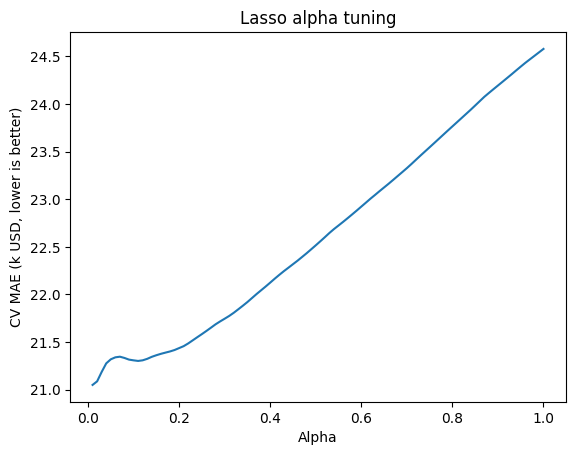
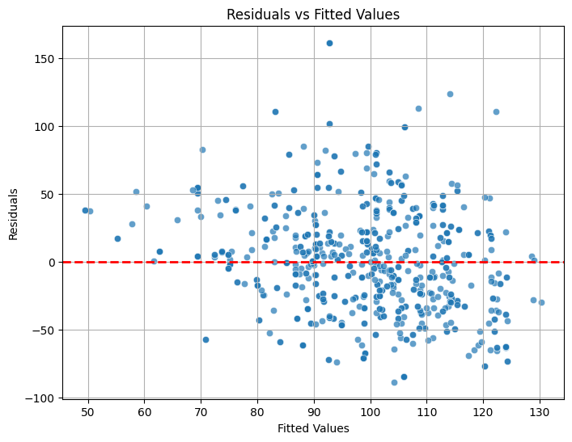
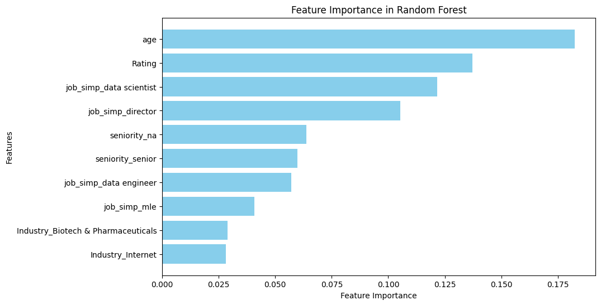

# 🧠 Data Science Salary Estimator

A complete end-to-end machine learning project that predicts data science salaries based on job descriptions. It includes web scraping, data cleaning, feature engineering, model tuning, and API deployment using Flask.

---

## 📊 Project Overview

- Created a tool that estimates data science salaries (MAE ~ $11K) to help professionals negotiate better offers.
- Scraped over 1,000 job descriptions from Glassdoor using Python and Selenium.
- Engineered features from job descriptions to quantify the importance of Python, Excel, AWS, and Spark.
- Trained and tuned Linear, Lasso, and Random Forest Regressors using GridSearchCV.
- Deployed a production-ready Flask API for real-time predictions.

---

## 🗃️ Code & Resources Used

- **Python Version**: 3.10+
- **Main Packages**: `pandas`, `numpy`, `sklearn`, `matplotlib`, `seaborn`, `flask`, `selenium`, `pickle`
- **Setup Requirements**:  
    ```bash
    pip install -r requirements.txt
    ```

---

## 🧹 Web Scraping

Using a customized scraper, we collected:

- Job Title  
- Salary Estimate  
- Description  
- Company Info  
- Headquarters, Size, Age  
- Industry, Sector, Revenue  
- Competitors  

Results are stored in 
---

## 🧼 Data Cleaning

Created custom features:

- Parsed salaries (hourly, employer-provided)  
- Extracted company rating, state, and age  
- Flagged skills: Python, R, Excel, AWS, Spark  
- Simplified job title & seniority  
- Computed description length  

---

## 📈 Exploratory Data Analysis (EDA)

Used pivot tables and visualizations to explore:

- Salary by job title  
- Job opportunities by state  
- Correlations among features  

---

## 🧠 Model Building

- Converted categorical variables to dummy variables  
- Split data (80% train, 20% test)  
- Evaluated using MAE (Mean Absolute Error)  

### Models Tested:
- Multiple Linear Regression (baseline)  
- Lasso Regression (handles sparsity)  
- Random Forest (best performance)  

---

## 📊 Model Performance

| Model              | MAE   |
|--------------------|-------|
| Random Forest      | 11.22 |
| Linear Regression  | 18.86 |
| Ridge Regression   | 19.67 |

---

## 🚀 Productionization (Flask API)

### API Workflow:
1. Takes job data as JSON input  
2. Returns predicted salary  

---

## 🛠️ How to Run This Project (Windows / Linux / macOS)
```
cd path/to/repository/directory/  
```

2️⃣ **Create a Virtual Environment**  

For macOS/Linux:  
```bash
python3 -m venv .venv # (it creates a virtual environment named .venv)
source .venv/bin/activate # (it activates the virtual environment)
```

For Windows:  
```bash
python -m venv .venv (it creates a virtual environment named .venv)
.venv\Scripts\activate (it activates the virtual environment)
```

3️⃣ **Install Dependencies**  
```bash
pip install -r requirements.txt # (it installs all the dependencies)
```
4️⃣ **Load and  Clean Data**

Next run the data_cleaning.py file using this command:
```bash
python data_cleaning.py
```

This file will sort through a pre-existing csv file called `glassdoor_jobs.csv`, which contains information about data science jobs scraped from the Glassdoor job search engine. The script `data_cleaning.py` creates some new features that we will use later in analysis. These features include but are not limited to:
| Feature | Description | 
| Hourly | Boolean yes/no if the job post listed salary as an hourly wage instead of annual |
| Minimum Salary | Lower-end of the given salary range | 
| Maximum Salary | Upper-end of the given salary range | 
| Average Salary | Average of the given salary range | 
| Age | Age of the company as determined from its founded date | 

There are additional columns created that store booleans which can quickly determine if a specific skill was mentioned in the job description, such as Python. 

Next we can perform EDA and prepare the input for model building:
```
1. Open `data_cleaning.ipynb` (note that this is a Jupyter notebook and not a simple python script like in the previous step)
2. select the kernel .venv/bin/activate
3. run all cells. (it loads the data and cleans it)
```

This script begins by printing basic information about the dataframe meant to familiarize the user with its structure and contents. It also walks you through several plots that show the dataframe features and their relationships. For example, it produces this correlation matrix between various features:


There are also some additional, small cleaning tasks that occur in this script. For example, we remove rows with missing values, or rows that have mistakenly stored information in the wrong column. For this reason, we will produce a new csv file with our refined dataset which is called `eda_data.csv`.

4️⃣ **Train and Evaluate Models**  

In this step, we use the `model_building.ipynb` notebook to train and evaluate several machine learning models for predicting salaries for data science jobs. To run the script, do:

```
1. Open `model_building.ipynb` 
2. select the kernel .venv/bin/activate
3. run all cells. (it loads the data and cleans it)
```

 The notebook explores multiple models, including:

- **Linear Regression**: A baseline model for interpretability.
- **Lasso Regression**: To handle sparsity and feature selection.
- **Random Forest**: A powerful ensemble model that achieves the best performance.

#### Example Figures:
The notebook generates several visualizations to analyze model performance. Below are some examples:

1. **Lasso Regression Alpha Tuning**  
   This plot shows how the Mean Absolute Error (MAE) changes with different values of the regularization parameter `alpha` in Lasso Regression.  
   

2. **Residuals vs Fitted Values**  
   This scatter plot helps assess the goodness of fit by showing residuals against fitted values for the OLS model.  
   

3. **Random Forest Feature Importance**  
   A bar chart highlighting the top 10 most important features identified by the Random Forest model.  
   

4. **Learning Curve**  
   This plot shows the training and validation errors as a function of the training set size, helping to diagnose overfitting or underfitting.  
   


5️⃣ **Start the Flask API**  
```bash
python FlaskAPI/app.py #(it starts the Flask API server)
```

Server runs at: [http://127.0.0.1:5000](http://127.0.0.1:5000)

6️⃣ **Test the API**

- **Option 1**: Python script  
    ```bash
    python FlaskAPI/make_request.py ##(it makes a request to the API)
    ```

- **Option 2**: curl (replace with valid path)  
    ```bash
    curl -X POST http://127.0.0.1:5000/predict -H "Content-Type: application/json" -d @FlaskAPI/data_input.json #(it makes a request to the API using curl)
    ```

- **Option 3**: Postman  
    - Method: POST  
    - URL: [http://127.0.0.1:5000/predict](http://127.0.0.1:5000/predict)   (it makes a request to the API using Postman)
    - Body: raw → JSON → paste from `sample_input.json`  

---

## 🧾 Directory Structure

```plaintext
Predict_DataScience_Salary/
├── model_building.ipynb
├── eda_data.csv
├── requirements.txt
├── random_forest_model.pkl
├── FlaskAPI/
│   ├── app.py
│   ├── make_request.py
│   └── sample_input.json
```

---

## 📌 Final Note

The trained Random Forest model is used in production via Flask and achieves a MAE of ~11K. This tool is designed to empower data scientists to better understand the market value of their skills.
